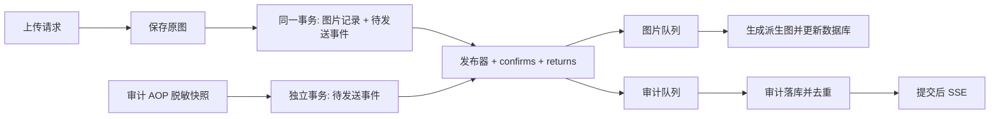

# RabbitMQ 图片处理与审计

上传请求保存原图后即返回。中图和缩略图由后台消费生成，已有页面保持原图，下次查询自然使用派生图。审计请求线程完成采集和脱敏后写入待发送表，消费者异步写入审计表，提交后推送现有风险 SSE。



## 行为与可靠性

- 普通开发未设置 `messaging.enabled=true` 时保留同步行为；Docker profile 默认启用。`MESSAGING_ENABLED=false` 可关闭，但必须先排空消息和待发送任务。
- 上传接口、图片查询接口和 `ImageVO` 未新增字段。派生图未完成时不返回对应 URL；沿用原图回退。WebP 保持仅原图，历史图片不自动补跑。
- 使用单个 backend 进程中的两个独立监听容器，图片并发为 1、prefetch 为 1；审计也使用独立线程。多 backend 实例的 SSE 广播不属于本版能力。
- 图片消费者与删除、编辑共享图片行锁。锁覆盖对象读写及数据库更新，以保证权限和删除顺序；大图处理期间同一图片的编辑可能等待。单张图片的尺寸校验仍在请求线程执行。
- 派生图只更新中图和缩略图字段，不覆盖名称、分类、权限。两个对象都保存后才提交 key。任务失败或事务回滚时持久化清理任务；清理前重新检查 key 是否仍被图片引用。
- 派生图字段更新与 `IMAGE_CACHE` 缓存刷新事件在同一事务提交。刷新事件在提交后消费；缓存故障独立重试，不会因图片事务已经成功而静默丢失刷新。
- 对象存储与数据库不具备原子事务。回滚回调使用独立事务保存清理事件；若数据库同时不可写，会尝试直接清理并记录错误。进程在原图保存后、数据库提交前被强制终止仍可能留下孤立对象，不能宣称跨系统 exactly-once。
- RabbitMQ 采用持久化 quorum 队列和持久化消息。当前是单节点持久化部署，磁盘丢失不具备多副本高可用保证；数据卷应备份。
- 数据库待发送表是可靠重试依据。消息体为 JSON，不携带图片二进制、Base64、登录 token 或签名 URL。消费者以事件 ID 和投递 token 查找锁定的数据库快照，避免旧投递覆盖新的重试。
- 发布器批量 20 条，每轮默认间隔 1 秒；发送确认等待上限 5 秒，发布租约 60 秒。连接失败退避重试，最长 300 秒；发布成功后崩溃允许重复投递，消费按事件去重。
- 消费失败最多额外重试 3 次，数据库保存次数，重启不重置。重试等待依次 2、4、8 秒；进入死信待发送后默认等待 16 秒。结构非法事件直接进入死信流程。
- 重试记录持久化后才确认原消息。终止重试后，原消息等待死信发送确认再 ACK；发送失败则保留死信待发送记录并重投原消息。消费者崩溃后仍可恢复。
- 审计 `event_id` 唯一，历史记录允许为空；原始发生时间、业务耗时、脱敏快照不因延迟消费改变。SSE 是即时提示，漏过的提示通过已有轮询补齐。
- 审计暂存失败不覆盖原业务返回值；输出异常类型和累计失败数，不输出载荷或异常敏感详情。数据库也不可用时不承诺零丢失。

## 配置与启动

在部署环境通过安全环境变量注入 `RABBITMQ_PASSWORD`，不能留空。可配置 `RABBITMQ_USERNAME`（默认 `image-space`）、`RABBITMQ_VHOST`（默认 `image-space`）。backend 在容器网络中连接 `rabbitmq:5672`。

镜像固定为 `rabbitmq:4.2.3-management@sha256:5deee3f817cb61eef73b2a934c9fe303be347a23db4e45123ec1698f25118e8c`。固定节点名为 `rabbit@rabbitmq`，数据卷为 `rabbitmq_data`。更换已初始化卷的密码不能只改环境变量，应通过 RabbitMQ 管理命令轮换账户。

```powershell
# 从仓库根目录执行；密码由当前安全环境或私有 .env 提供。
docker compose config --quiet
docker compose up -d --build rabbitmq backend
docker compose exec rabbitmq rabbitmq-diagnostics -q ping
docker compose exec nginx nginx -t
```

AMQP 不映射宿主机端口。管理界面仅绑定 [本机 15672 端口](http://127.0.0.1:15672)，远程运维使用 SSH 隧道，不增加公网 nginx 代理。Compose 默认合并 override；已有 nginx 证书和静态目录需按实际挂载检查。

后端镜像从源码构建；`.dockerignore` 排除本地 `application.yml` 和 `.env`，连接信息通过环境变量注入。

## 故障检查与重放

状态流转：`PENDING → PUBLISHING → SENT → DONE`。消费可能先于发布确认完成，发布器不会覆盖 `DONE` 或新的重试状态。失败耗尽后为 `DEAD_PENDING → DEAD_PUBLISHING → DEAD`。

每分钟应用记录按状态统计的积压、最老未完成事件年龄、两条死信队列数量。审计写入失败有独立累计计数。成功记录默认保留 7 天，每轮最多清理 1000 条；未完成、失败记录不自动删除。

```powershell
docker compose logs --tail 100 backend rabbitmq
docker compose exec rabbitmq rabbitmqctl list_queues -p image-space name messages_ready messages_unacknowledged consumers
```

在数据库中检查 `message_outbox` 的 `event_id`、`event_type`、`state`、`failures`、`next_attempt_at` 和 `last_error`；不要将 payload 导出到工单或公共日志。

修复存储、数据或连接问题后，按事件 ID 重放已经确认进入死信的任务：

```powershell
pwsh -File backend/scripts/replay-message.ps1 -EventId '<事件 UUID>'
```

脚本只重放 `DEAD`，保留事件 ID并重置重试次数；输出 `1` 表示已重置，`0` 表示状态不匹配或事件不存在。`DEAD_PENDING` 不应手工改成已发送，等待发布器完成可靠转发。

死信队列中的旧副本保留作证据，重放通过数据库发布器进行；队列数量因此包含历史副本。确认数据库没有待处理死信且已完成必要取证后，才在管理界面清理相应死信队列，不得无差别清空业务队列。

回滚前停止新写入，等待待发送表未完成记录及两条业务队列的 ready/unacked 都为零，处理或保留死信并备份数据卷，再关闭消息模式。V5 是增量迁移，回滚应用时保留表和字段，不删除 Flyway 历史。

## 隔离本地验收

验收 Compose 固定项目名 `image-space-mq-test`，使用独立 MySQL、RabbitMQ 和图片数据卷，本地存储替代 R2。端口：后端 18088、媒体适配器 18089、MySQL 13316、Redis 16379、AMQP 15673、管理界面 15683，全部仅绑定回环地址。

```powershell
New-Item -ItemType Directory -Force frontend/output/messaging | Out-Null
# 仅首次生成；复用已有卷时保留原测试凭据。
$mqTestSecret = [Guid]::NewGuid().ToString('N')
Set-Content frontend/output/messaging/messaging-test.env "MQ_TEST_PASSWORD=$mqTestSecret"
docker compose --env-file frontend/output/messaging/messaging-test.env -f docker-compose.messaging-test.yaml up -d --build
docker compose --env-file frontend/output/messaging/messaging-test.env -f docker-compose.messaging-test.yaml exec -T rabbitmq rabbitmqctl add_vhost image-space-it
docker compose --env-file frontend/output/messaging/messaging-test.env -f docker-compose.messaging-test.yaml exec -T rabbitmq rabbitmqctl set_permissions -p image-space-it mq-test '.*' '.*' '.*'

$env:MQ_TEST_PASSWORD = (Get-Content frontend/output/messaging/messaging-test.env).Split('=', 2)[1]
Push-Location backend
mvn clean verify -Pmessaging-it
Pop-Location
python backend/scripts/messaging-smoke.py
```

`MessagingIT` 使用独立的 `mq_integration` 数据库和 `image-space-it` vhost，避免与验收 backend 互相消费；运行前不要把这些地址改为现有业务数据库。

`messaging-smoke.py` 创建随机测试账户，预热后各测 3 次相同 2400×1600 PNG，比较同步响应、异步响应和异步完成时间，并测试停 RabbitMQ、积压补发、删除/权限变更及重启恢复。结果存入 `frontend/output/messaging/messaging-acceptance.json`。测试凭据、会话、样本及截图均在被 Git 忽略的输出目录，不提交。

`media` 是仅用于验收的本地适配器，先调用后端真实元数据或授权端点，再读取共享测试卷；不代表 Cloudflare 边缘缓存测试通过。生产 Worker 继续使用现有代码。

验收结束可停止容器并保留数据卷：

```powershell
docker compose --env-file frontend/output/messaging/messaging-test.env -f docker-compose.messaging-test.yaml down
```

不要附加 `-v`，除非明确需要销毁隔离测试数据。生产部署不使用此验收 Compose。
